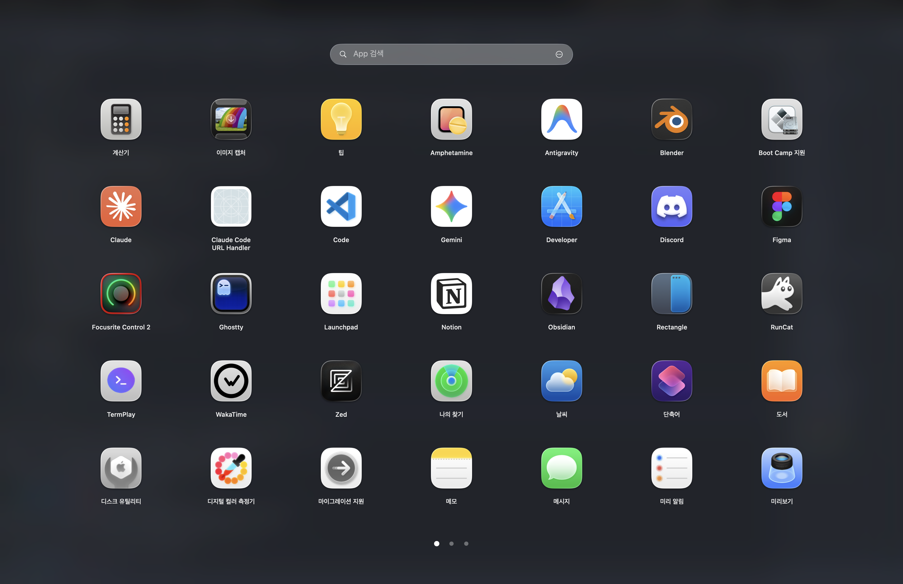

# Launchpad

[English](README.en.md)

macOS 26에서 빠진 기존 Launchpad의 사용감을 되살리는 네이티브 macOS 앱 런처입니다. 목표는 단순한 앱 목록이 아니라, Apple Launchpad처럼 자연스러운 제스처, 페이지 전환, 폴더, 검색, 드래그 앤 드롭을 제공하는 것입니다.

## 주요 기능

- `/Applications`, `/System/Applications`, `~/Applications` 앱 스캔
- 기존 Launchpad와 비슷한 7x5 페이지형 그리드
- 앱 검색과 키보드 탐색
- 앱 실행, Finder에서 보기, Dock에 추가, 휴지통으로 이동
- 앱 드래그 재정렬
- 앱을 앱 위에 드롭해 폴더 생성
- 폴더 안 앱 추가, 제거, 재정렬, 이름 변경
- 페이지 도트, 마우스 드래그, 트랙패드 스와이프 페이지 이동
- 4/5손가락 트랙패드 pinch/spread 열기/닫기
- F4 키, 전역 단축키, 메뉴 막대 아이콘, 핫 코너
- 네이티브 Launchpad 레이아웃 가져오기
- 그리드/외관/앱 소스 설정
- 아이콘 다운샘플 캐시와 SwiftUI 업데이트 범위 최적화

## 설치와 실행

로컬 앱 번들을 빌드합니다.

```sh
Scripts/build-app.sh
open .build/Launchpad.app
```

SwiftPM으로 직접 실행할 수도 있습니다.

```sh
swift run Launchpad
```

로그인 항목, 접근성 권한, 전역 단축키처럼 앱 번들 identity가 필요한 기능은 `.build/Launchpad.app`으로 테스트하는 편이 정확합니다.

## 검증

변경 후 기본 검증:

```sh
swift build
swift run LaunchpadCheck
```

앱 번들 검증:

```sh
Scripts/build-app.sh
open .build/Launchpad.app
```

수동 체크:

- 빈 배경 클릭으로 런처/폴더 닫힘
- ESC가 폴더, 검색, 런처 순서로 닫힘
- 앱을 앱 위로 드래그하면 폴더 생성
- 앱을 폴더 위로 드래그하면 폴더에 추가
- 실패하거나 취소된 드래그 후 아이콘 투명도 복구
- 페이지 스와이프가 아이콘 드래그와 충돌하지 않음

## 아키텍처

```text
Launch        실행 엔트리
LaunchApp     AppKit, SwiftUI, 입력, 권한, 설정, 시스템 연동
LaunchCore    Foundation만 사용하는 순수 규칙
LaunchCheck   LaunchCore 규칙 검증 실행 파일
```

규칙:

- `LaunchCore`는 `Foundation`만 import합니다.
- AppKit, SwiftUI, 권한, persistence, 시스템 API는 `LaunchApp`에 둡니다.
- `AppState`가 단일 observable UI 모델입니다.
- process-level AppKit wiring은 `AppDelegate`가 담당합니다.
- SwiftUI view는 `AppState`를 호출하고, AppKit 부작용은 `LauncherActions`를 통해 나갑니다.

자세한 내용은 [docs/ARCHITECTURE.md](docs/ARCHITECTURE.md)를 보세요.

## 패키징

앱 번들:

```sh
swift run LaunchpadPackager app
```

DMG:

```sh
swift run LaunchpadPackager dmg
```

서명과 notarization 흐름은 [docs/PACKAGING.md](docs/PACKAGING.md)에 정리되어 있습니다.

## 상태

현재는 MVP를 넘어 실제 사용 품질을 다듬는 단계입니다. 우선순위는 네이티브 수준의 제스처, 부드러운 페이지 전환, 안정적인 폴더 드래그, 낮은 메모리 사용량입니다.
