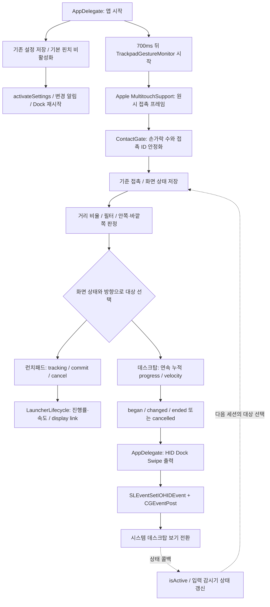

# 트랙패드 / 데스크탑 보기 아키텍처 조사

조사일: 2026-09-10. 기준 커밋: `78bac765cd16` (`main`). 제품 소스 변경 없이 조사했다.
환경: macOS 26.6.2, Xcode 26.6 (17F113), Apple Swift 6.3.3.
지식 그래프로 구조를 탐색한 뒤 실제 Swift 소스와 호출부를 확인했다. 그래프의 일부 심볼 범위와 관계가 현재 소스를 완전히 반영하지 않아 결론은 소스를 기준으로 삼았다.

> 2026-09-17 업데이트: 이 문서가 지적한 일회성 출력은 macOS 27 Dock Swipe HID 연속 출력으로 교체됐다. 아래의 일회성 경로 설명은 변경 전 원인 기록이며, 현재 상태는 [macOS 27 호환성 조사](MACOS_27_COMPATIBILITY_RESEARCH.md#5-연속-제스처-조사-결과)를 기준으로 한다.

## 1. 결론과 제품 계약

현재 구조는 **기본 macOS 핀치 제스처를 비활성화하고, 우리 프로세스가 접촉 데이터를 직접 인식하는 구조**다. 런치패드 UI를 숨겨도 이 소유권은 유지된다. 사용자가 설명한 구조와 일치한다.

데스크탑 보기는 현재 타입 30 Dock Swipe 이벤트에 macOS 27용 HID payload를 붙여 제어한다. 누적 진행률과 release velocity를 보내므로 시스템 창 애니메이션이 손가락을 따라 움직이고, 최종 정착은 Dock이 처리한다.

유지해야 할 사용자 계약:

| 프로세스 / 화면 상태 | 손동작 | 기대 결과 |
| --- | --- | --- |
| 실행 중, 런치패드 UI 숨김, 일반 창 표시 | 오므리기 | 우리 런치패드 열기 |
| 실행 중, 런치패드 UI 숨김, 일반 창 표시 | 펼치기 | 시스템 데스크탑 보기 |
| 실행 중, 우리 런치패드 표시 | 펼치기 | 런치패드 닫기 |
| 실행 중, 데스크탑 보기 활성 | 오므리기 | 원래 창 복귀 |
| 제스처 진행 중 | 멈춤 / 되감기 / 손 떼기 | 진행률 추종 및 적절한 취소·완료 |
| 프로세스 정상 종료 | 해당 없음 | 저장한 기본 macOS 제스처 설정 복원 |

기본 제스처를 다시 켜서 펼치기를 OS에 맡기는 변경은 이 계약의 일반적인 해결책이 아니다. 기존 Apps/Launchpad 제스처와 충돌을 피하는 목적까지 함께 지켜야 한다.

## 2. 입력부터 출력까지



### 2.1 기본 제스처 소유권

[AppDelegate+Input.swift](../Sources/LaunchApp/AppDelegate/AppDelegate+Input.swift)의 `prepareExclusiveTrackpadGestures()`는 이전 비정상 종료에서 남은 스냅샷을 먼저 복원하고, 데스크탑 제어 심볼을 확인한 뒤 기본 핀치를 예약한다.

[SystemTrackpadSettings.swift](../Sources/LaunchApp/Input/SystemTrackpadSettings.swift)의 `reserveNativeLaunchpadPinch()`는 다음 설정을 0으로 쓴다.

- `com.apple.AppleMultitouchTrackpad`, `com.apple.driver.AppleBluetoothMultitouch.trackpad` 도메인의 4/5손가락 핀치 구형·신형 키.
- 현재 호스트의 전역 설정에 있는 `com.apple.trackpad.fourFingerPinchSwipeGesture`, `com.apple.trackpad.fiveFingerPinchSwipeGesture`.

기존 값과 값의 부재까지 `UserDefaults.standard` 스냅샷으로 저장한다. 적용에는 Apple의 `activateSettings -u`, `notifyutil`, `launchctl kickstart -k .../com.apple.Dock.agent`를 사용한다. 즉, macOS에 우리 recognizer를 등록하는 공식 API 호출이 아니라 **설정을 통해 기존 동작을 끄고 별도 입력 감시기를 운영**한다.

예약 시 Dock action은 Apps=0, Show Desktop=1로 분리하고 물리 4/5손가락 핀치는 0으로 만든다. 이로써 macOS 설정 UI에서는 만들 수 없는 조합에서도 합성 Dock Swipe는 받아들이되 실제 손동작은 시스템 Launchpad나 Show Desktop에 중복 전달되지 않는다. 종료 시 저장한 원래 값과 값의 부재를 복원한다.

[AppDelegate.swift](../Sources/LaunchApp/AppDelegate/AppDelegate.swift)의 `applicationShouldTerminate`가 복원한다. SIGINT/SIGTERM도 정상 종료 경로로 연결한다. SIGKILL이나 크래시 때 즉시 복원되는 구조는 아니며 다음 실행에서 복구를 시도한다. UI hide는 복원을 호출하지 않는다.

### 2.2 원시 입력과 순수 판정

[TrackpadGestureMonitor.swift](../Sources/LaunchApp/Input/TrackpadGestureMonitor.swift)는 AppKit의 로컬 스크롤·스와이프 이벤트와 비공개 `PinchContactMonitor`를 함께 가진다. 글로벌 핀치의 핵심은 후자다.

`PinchContactMonitor.start()`는 `MultitouchSupport.framework`를 `dlopen`하고 `MTDeviceCreateList`, `MTRegisterContactFrameCallback`, `MTDeviceStart`를 동적으로 연결한다. C 구조체 `MTTouch`와 함수 ABI는 프로젝트에서 직접 선언했다. 콜백은 `pathIndex`를 접촉 ID로, 정규화 좌표와 `state`를 순수 Swift 샘플로 변환한다.

프레임 처리는 `NSLock` 아래에서 장치별 세션을 관리하고 한 번에 하나의 활성 장치만 사용한다. 이후 규칙은 `LaunchCore`에 있다.

| 규칙 | 실제 동작 |
| --- | --- |
| `TrackpadContactQuality` | `state == 4`만 접촉으로 계산. 같은 ID의 손가락 쌍 거리 비율을 로그 중앙값으로 집계 |
| `TrackpadContactGate` | 정확한 손가락 수와 ID 집합 확인. 단일 개수에서 2프레임 또는 8ms 후 임시 후보, 20ms 후 안정 접촉. 복수 개수는 60ms 대기 |
| 접촉 누락 유예 | 기본 80ms. 모든 접촉이 사라지면 즉시 종료 |
| `TrackpadGestureIntentArbiter` | 전체 이동을 제거한 방사형 움직임과 일관성 판정. 20ms 접촉 안정화 뒤 로그 거리 변화 0.025 초과에서 보통 2프레임, 0.06 이상이면 1프레임으로 방향 확정 |
| 거리 필터 | 하드웨어 타임스탬프 간격을 사용하는 저역 통과 필터, 응답 시간 18ms |
| `SystemShowDesktopGestureOwner` | 기준 접촉 시점의 런치패드 표시 / 데스크탑 활성 상태를 저장 |
| `SystemShowDesktopGestureSession` | 로그 거리 비율을 양방향 누적 progress로 바꾸고 마지막 프레임 변화에서 terminal velocity 생성 |

`Automatic`은 현재 4손가락이다. 데스크탑 출력을 위해 선택한 설정에 4손가락이 없으면 감시 개수에 4를 추가하므로, 3손가락 설정에서도 `[3, 4]` 안정화 규칙이 적용될 수 있다.

방향 판정기는 처음 확정한 방향을 유지한다. 다만 최종 런치패드 `lockedIntent`는 판정 방향 자체가 아니라 저장된 화면 소유자로부터 얻는다(보임→close, 일반 화면→open). 방향 인식과 동작 대상 선택은 구분해서 분석해야 한다.

### 2.3 런치패드 출력

[TrackpadGestureSession.swift](../Sources/LaunchCore/TrackpadGestureSession.swift)의 `trackPinch()`가 연속 진행률을 생성한다. 기본 dead zone은 0.0035, 열기 범위는 0.26, 닫기 범위는 0.30이다. 손을 떼면 기본 진행률 0.5를 기준으로 commit/cancel을 보낸다.

입력 감시기는 최신 tracking과 terminal 업데이트를 메인 큐로 전달한다. [LauncherLifecycle+Pinch.swift](../Sources/LaunchApp/App/LauncherLifecycle+Pinch.swift)는 진행률과 속도를 갱신하고, [LauncherLifecycle.swift](../Sources/LaunchApp/App/LauncherLifecycle.swift)는 `NSWindow.displayLink`로 창 알파·컨테이너 크기를 적용한다. 놓았을 때의 목표는 진행률과 예측 속도로 결정하고 스프링으로 마무리한다.

이 경로에만 손가락을 따라가는 표시 루프가 있다. 추가 검토점으로 `finishPinch(committed:)`는 전달된 `committed`를 목표 결정에 사용하지 않고 로그에만 사용한다. 인식 실패에 의한 cancel과 정상 릴리스의 의미가 UI까지 그대로 유지되는지는 별도 검증 대상이다.

### 2.4 데스크탑 출력: 변경 전 일회성 경로와 현재 연속 경로

입력 감시기 435행 이후의 분기에서 임계값 전에는 `.wait`로 돌아간다. `.show` 또는 `.restore`가 되면 `ignoreUntilAllTouchesLift()`를 호출하고 콜백을 한 번 보낸다. 이후 손가락 위치, 속도, 역방향 이동은 시스템에 전달하지 않는다.

`AppDelegate+Input.swift` 113행의 콜백은 두 결정을 모두 `showDesktopController.toggle()`로 바꾼다.

[SystemShowDesktopController.swift](../Sources/LaunchApp/Input/SystemShowDesktopController.swift)는 현재 [LaunchDockSwipe.m](../Sources/LaunchAppPrivateSupport/LaunchDockSwipe.m)을 통해 `began/changed/ended/cancelled`, 누적 progress, terminal velocity를 보낸다. HID 경로를 로드하지 못한 경우에만 `CoreDockSendNotification("com.apple.showdesktop.awake", 0)`을 완료 시점 fallback으로 사용한다.

현재 Mac에서 심볼 주소의 소속을 `dladdr`로 읽어 확인했다. 두 `CoreDock*` 심볼은 ApplicationServices 아래 **HIServices.framework**에 있고, `MT*`는 **MultitouchSupport.framework**에 있다. 이름 때문에 외부 라이브러리나 별도의 CoreDock 패키지로 이해할 필요는 없다. 심볼 확인 과정에서는 제스처 호출이나 시스템 설정 변경을 하지 않았다.

## 3. 외부 라이브러리와 참고 구현

| 항목 | 현재 프로젝트에서의 지위 | 조사 결과 |
| --- | --- | --- |
| Sparkle 2.9.3 | 유일한 외부 Swift 런타임 패키지 | `AppUpdater.swift`의 자동 업데이트·업데이트 확인. 제스처와 연결 없음 |
| MultitouchSupport | Apple 비공개 시스템 프레임워크 | 입력 접촉 읽기. 자체 Swift C ABI 선언으로 연결 |
| CoreDock 함수 / HIServices | Apple 비공개 심볼 | 데스크탑 상태 콜백과 연속 출력 실패 시 fallback 토글 |
| HIDEvent / SkyLight | Apple 비공개 클래스·심볼 | macOS 27 Dock Swipe progress·phase·velocity payload 부착 |
| SystemAdministration의 activateSettings | Apple 시스템 실행 파일 | 기본 제스처 설정 적용 |
| AppKit / Core Animation | Apple 플랫폼 기능 | 로컬 이벤트와 우리 창 애니메이션 |
| pnpm / package.json | 개발·패키징 명령 래퍼 | Swift 실행·빌드·번들 명령을 호출. 제스처 런타임 라이브러리가 아님 |
| LaunchOS / LaunchNow / LaunchNext / CalfTrail Touch | 기존 기획 문서의 조사 참고 | 현재 패키지 의존성으로 들어 있지 않음 |
| Mac Mouse Fix / dockswipe | 이번 조사에서 비교한 외부 구현 | 패키지 의존성은 아니며 macOS 27 이벤트 구조의 참고 근거 |

[Package.swift](../Package.swift), [Package.resolved](../Package.resolved), [AppUpdater.swift](../Sources/LaunchApp/System/AppUpdater.swift)를 확인했다. 기존 [제스처 계획](superpowers/plans/2026-06-29-trackpad-launch-gesture.md)의 research baseline에는 LaunchNow의 설정 비활성화 방법과 CalfTrail Touch의 재생 문제 등이 명시되어 있다. 이것은 참고 흔적이며 소스 복제나 라이브러리 사용의 증거는 아니다. 해당 문서의 Automatic `[3,4]` / 조건부 예약 설명은 현재 코드와 다르다.

외부에서 연속 시스템 제스처를 보내는 구현은 찾았다. [Mac Mouse Fix의 TouchSimulator.m](https://github.com/noah-nuebling/mac-mouse-fix/blob/master/Helper/Core/Touch/TouchSimulator.m)은 Dock swipe 이벤트에 누적 진행률, 단계, 종료 속도를 넣어 전송한다. 소스에는 OS 버전별 이벤트 표현과 방향·종료 처리의 차이가 있다. 이는 연속 출력 경로를 검토할 구체적인 근거이지만, 우리 앱의 기본 제스처 비활성 상태에서도 원하는 UX가 완성된다는 검증은 아니다.

[dockswipe](https://github.com/oomol-lab/dockswipe)는 같은 종류의 이벤트를 보내는 CLI다. 자체 README에 미검증 부분과 방향·종료 관련 제약을 명시하므로 바로 제품 의존성으로 넣을 근거는 부족하다. 또한 README의 MMF를 MIT로 설명한 부분은 현재 [MMF License 원문](https://github.com/noah-nuebling/mac-mouse-fix/blob/master/License)의 명칭과 다르다. 코드 도입을 결정할 때 원본 라이선스와 대상 버전을 확인해야 한다. 이번 조사에서는 외부 코드를 제품에 도입하지 않았다.

## 4. 확인된 문제와 아직 가설인 부분

### 확인됨: 출력에서 진행률·취소·복귀 의도가 손실됨

데스크탑 출력은 한 번의 토글이며 show/restore의 의미도 출력 호출에서 합쳐진다. `toggle()`은 반환 상태가 0이면 실제 화면 확인 전에 `setActive(!isActive)`를 호출한다. 초기 상태도 false이며 시작 시 현재 데스크탑 상태를 조회하지 않는다.

따라서 콜백이 늦거나 상태가 다른 경로로 변경되면 입력이 참조하는 상태와 화면이 어긋날 가능성이 있다. 콜백 상태 1/2의 의미와 선언한 ABI가 이 OS에서 항상 맞는지는 아직 검증하지 않았다. 심볼 존재나 notification 반환값만으로 실제 전환 성공을 단정할 수 없다.

### 확인됨: 입력 준비와 기본 제스처 예약의 생명주기가 분리됨

기본 핀치를 먼저 끄고 700ms 뒤 감시기를 시작한다. 감시기는 장치가 하나라도 있으면 준비 완료로 취급하고 `MTDeviceStart` 반환값을 무시한다. 입력 초기화 실패가 예약 복원으로 연결되지 않는다.

비공개 입력을 못 쓰면 `.magnify`를 **로컬** `NSEvent` 모니터로 받는다. 이는 다른 앱이 포커스를 가진 상태에서 글로벌 4손가락 입력을 대체하는 경로가 아니다.

설정이 Disabled이면 입력 콜백을 중지하지만 기본 제스처 예약을 해제하지 않는다. 어떤 Disabled UX를 선택하든 현재는 기본 입력과 대체 입력이 함께 비는 경로가 존재한다.

`PinchContactMonitor.stop()`은 콜백과 세션을 지울 뿐 MT 콜백 등록·장치 시작을 해제하지 않고 `_isReady`도 남긴다. 현재 OS에는 `MTUnregisterContactFrameCallback`과 `MTDeviceStop` 심볼이 존재하지만 이 코드에서는 사용하지 않는다. 재시작 때 데스크탑 상태를 false로 초기화한 채 다시 동기화하지 않을 수 있다는 점도 점검 대상이다.

### 재현됨: 모든 손가락을 떼기 전 재무장 가능

제품의 `TrackpadContactQuality.swift`를 그대로 컴파일한 작은 진단 프로그램으로 다음을 확인했다.

```text
4손가락으로 기존 세션 claim
0.040초: 3손가락 남음 → waiting
0.130초: 3손가락 남음 → ended
0.140초: 네 번째 손가락 복귀 → waiting
0.150초: 4손가락 유지 → provisional (새 제스처 후보)
이 사이 모든 손가락이 떨어진 프레임은 없음
```

80ms 유예 이후 gate가 초기화되고 입력 감시기의 `.ended` 처리도 장치 상태를 새로 만든다. 새로운 후보는 기준 좌표와 화면 소유자를 다시 잡을 수 있다. 이미 데스크탑 show/restore를 발행한 경로에는 모두 뗄 때까지 무시하는 보호가 있으므로 모든 종료 경로가 같은 것은 아니다.

이 결과는 **부분 이탈 후 세션 재시작이라는 경계 조건의 재현**이다. 사용자의 ‘펼칠 때 런치패드가 열림’ 전체 현상을 하드웨어에서 재현한 결과는 아니다. 실제 접촉·방향·화면 상태 로그를 연결해 직접 원인을 확인해야 한다.

### 추가 검증 대상

- 대상 화면 소유자는 접촉 후보 생성 시 저장된다. 제스처 확정 전에 UI/데스크탑 상태가 바뀌어도 기존 세션은 이전 값을 쓴다.
- 방향 판정의 증거 누적은 프레임 수 기준이다. `timestamp` 인자는 사용하지 않으므로 입력 주기에 따라 초기 판정 시간이 달라진다.
- 메인 큐 전달에는 세션 ID가 없고, 이전 terminal 대기 중 새 tracking을 버린다. UI 전환·입력 재시작과 겹칠 때의 순서를 검사할 필요가 있다.
- `onSystemShowDesktop`에는 런치패드 입력 콜백과 같은 드래그·설정 검사가 없다.
- 개발/배포 번들의 스냅샷 저장소는 다르지만 수정하는 시스템 설정은 같다. 두 프로세스가 동시에 실행되면 예약/복원이 경합할 수 있다.
- 설정 적용 자식 프로세스들의 종료 상태를 검사하지 않는다. 현재 ‘예약 성공’은 설정 값을 다시 읽은 결과이며 Dock이 실제로 재등록했는지 확인한 결과가 아니다.

위 항목은 소스에서 확인한 위험 경로다. 현재 사용자의 증상을 각각 발생시켰다고 주장하는 목록은 아니다.

## 5. Xcode 검증 결과와 범위

| 검사 | 결과 |
| --- | --- |
| `swift build` | 통과 |
| `swift run LaunchpadCheck` | 통과: `LaunchpadCheck OK` |
| `swift test` | 55개 중 53개 통과, 2개 테스트에서 assertion 3개 실패 |
| 접촉 gate 진단 프로그램 | 위 재무장 순서 재현, assertion 통과 |
| 동적 심볼 조회 | 현재 OS에서 필요한 CoreDock / MT 심볼과 소속 확인 |
| 실제 손가락 연속 출력 / 방향 반전 / Dock 콜백 | 이번 조사에서 UI 동작 검증 완료하지 않음 |

실패 내용:

1. `testContactGateEndsWhenQualifiedFingersLiftOneAtATime`: 테스트는 접촉 누락 50ms 후 종료를 기대하지만 현재 기본 유예는 80ms다. 454행의 종료 기대와 458행의 재시작 기대가 실패한다.
2. `testContactGateLocksExtraContactsOnlyAfterLauncherClaim`: 추가 손가락이 들어오면 즉시 rejected를 기대하지만 현재 provisional 세션은 유예를 적용해 waiting을 반환한다(500행).

근거: [TrackpadIntentTests.swift](../Tests/LaunchCoreTests/TrackpadIntentTests.swift). 이 실패는 테스트와 구현의 계약 불일치다. 테스트를 통과시키려고 타이밍을 임의로 바꾸지 않았다.

XCTest 타깃은 `LaunchpadCore`만 의존한다. 순수 show/restore 결정 테스트가 통과해도 AppDelegate의 토글 라우팅, CoreDock 콜백, 화면 애니메이션은 검증되지 않는다. 마지막 Swift Testing의 “0 tests passed” 메시지는 위 XCTest 실패를 상쇄하지 않는다.

로컬 로그: `.build/architecture-swift-test.log`. 진단 소스: `.build/architecture-probe/main.swift` (둘 다 빌드 산출물이며 버전 관리 대상 아님).

재현 명령:

```sh
xcrun swiftc Sources/LaunchCore/TrackpadContactQuality.swift .build/architecture-probe/main.swift -o .build/architecture-probe/contact-gate
.build/architecture-probe/contact-gate
```

이번 단계는 구조 조사이므로 제품 앱을 새로 실행해 시스템 설정을 다시 예약하거나 Dock을 재시작하지 않았다. 이전 임시 이벤트 전송 실험의 프로세스 종료 코드도 시각적 성공 증거로 사용하지 않았다.

## 6. 수정할 순서

1. **입력 세션과 화면 상태의 계약을 먼저 고정한다.** 기존 진단 로그에 세션별 기준점·방향·대상·종료 사유·데스크탑 콜백을 연결하고 부분 이탈/복귀를 재생한다. 목표는 한 번의 손동작이 새 open으로 재해석되는 정확한 경로 확인이다. 기존 접촉 테스트의 유예 정책도 이때 맞춘다.
2. **예약과 입력 준비를 함께 성공·실패 처리한다.** 감시기 준비 실패, Disabled, 중지/재시작, 앱 종료에서 입력 공백과 상태 불일치를 없앤다. 정상 실행 중 UI hide가 예약을 풀지 않는 계약은 유지한다.
3. **데스크탑 출력에 연속 단계가 필요하다.** show/restore를 동일한 토글로 축약하는 대신 진행·되감기·완료·취소를 실제 Dock 제스처 경로에 연결하는 최소 구현을 검증한다. 순수 대상/방향/진행률 규칙은 LaunchCore, 시스템 이벤트 생성과 상태 콜백은 LaunchApp에 둔다. 기존 원시 입력과 런치패드 표시 코드는 재사용한다.
4. **현재 OS의 실제 화면으로 합격 여부를 판단한다.** 기본 제스처를 비활성화한 상태에서 천천히 펼치기, 중간 정지, 역방향 취소, 빠른 놓기, 데스크탑에서 오므려 복귀, 부분 접촉 이탈, 런치패드 표시 중 펼치기를 확인한다. 외부 이벤트 예제가 컴파일되는 것만으로 네이티브 UX 완성을 선언하지 않는다.

핵심 변경 지점은 입력 프레임을 버리는 데스크탑 분기와 `SystemShowDesktopController`의 출력 계약이다. 애니메이션 지속 시간이나 임계값만 조절해서 해결할 문제는 아니다.
