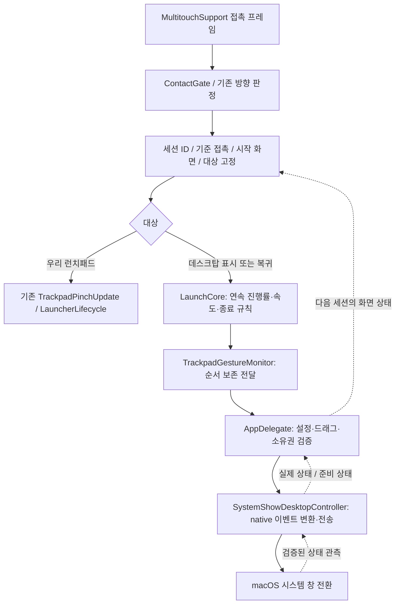
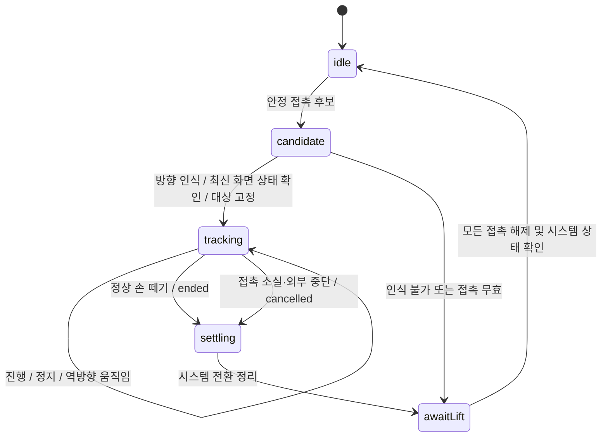

# 손가락을 따라가는 데스크탑 보기 설계

날짜: 2026-09-10  
기준: `78bac765cd16`, macOS 26.6.2 / Xcode 26.6  
상태: A 구현 후 사용자 로그에서 AX 알림 수신과 일부 정상 복귀 확인. 간헐적 중복·펼치기 실패가 남아 이벤트 경합과 숨김 시점을 수정했으며, 후속 실기 검증 필요.  
근거: [현재 아키텍처 조사](../../SHOW_DESKTOP_ARCHITECTURE_REVIEW.md).

## 우선순위 수정: 기본 Apps 열기만 비활성화

### 구현 결과와 남은 검증

- 기본 Apps 설정만 저장·비활성화하고, 물리 핀치와 데스크탑 설정은 보존한다. 자체 데스크탑 토글 출력은 제거했다.
- 사용자 실행에서 네이티브 데스크탑 동작은 확인했으나 복귀 오므리기에 우리 UI가 함께 열렸다. 같은 실행 로그에서 기존 CoreDock 상태 콜백은 수신되지 않았다.
- 상태 관측을 Dock의 `AXExposeShowDesktop` / `AXExposeExit` 알림으로 변경했다. 데스크탑에서 시작한 접촉은 종료 알림이 먼저 와도 모든 손가락을 뗄 때까지 macOS 소유로 유지한다.
- 관측 준비 전에는 기본 Apps 설정을 예약하지 않고 우리 UI 열기 제스처도 허용하지 않는다. 사용자의 `pnpm dev` 실행에서는 권한과 알림 수신을 확인했다. 데스크탑이 이미 열린 상태에서 앱을 시작하는 경우와 우리 UI 닫기·시스템 펼치기 동시 실행은 추가 실기 확인 대상이다.
- 후속 로그에 진입 알림 없이 `AXExposeExit`만 오는 구간이 있다. 이는 Exposé 공통 종료 알림이므로 그 자체로 데스크탑 진입 성공을 증명하지 않는다. 종료 알림도 현재 접촉을 시스템 소유로 고정하고, UI와 대기 중인 tracking/commit을 함께 취소하도록 수정했다. 이미 전달용으로 꺼낸 commit도 세대 번호로 무효화한다.
- 소유권 유지 범위는 접근·착지부터 이탈까지로 넓혔다. 실제 네 손가락 판정에는 여전히 접촉 단계만 사용한다. 닫기 스프링의 목표값으로 조기에 숨김을 선언하던 코드를 제거해, Dock presentation 옵션 복원과 실제 창 숨김 완료까지 런치패드 소유권을 유지한다.
- CLI·개발 번들·제품 번들은 사용자별 프로세스 잠금을 공유한다. 두 빌드가 시스템 설정을 동시에 저장·복원하는 경로를 막았고, 실제 CLI와 개발 번들이 초기화 전에 중복 실행을 거절하는지 검사했다. 이번 사용자 로그가 중복 프로세스에서 발생했다는 증거는 없다.
- `swift build`, `swift run LaunchpadCheck`, `swift test`(58개), 개발 앱 번들 빌드·서명 검증 통과. 네이티브 펼치기 실패 원인 전체를 확정하거나 해결했다고 판단하지 않는다. PID·단조 시간·실제 숨김 완료 로그를 추가해 다음 실기 기록에서 구분한다.

아래는 구현 전 결정 기록이다. 1–8절은 대안 B의 설계이며 현재 구현 구조를 설명하지 않는다.

사용자가 제안한 **기본 Apps/Launchpad 열기만 끄고 데스크탑 제스처는 macOS에 맡기는 방식(A)**을 먼저 검증한다. 아래 1–8절의 전체 핀치 예약·연속 이벤트 합성 설계(B)는 A가 제품 계약을 충족하지 못할 때 검토하는 대안이다. B의 전체 핀치 비활성화 조건을 A에 적용하지 않는다.

현재 코드는 `TrackpadFourFingerPinchGesture` 등 물리 핀치 설정 전체를 0으로 만든다. `showLaunchpadGestureEnabled`는 사용하지 않는다. 별도 Dock 설정인 `showLaunchpadGestureEnabled`와 `showDesktopGestureEnabled`는 [기존 설정 조사](https://zenn.dev/usagimaru/articles/a524d547233f94)에 기록되어 있다. 이 기록은 현재 macOS 26.6.2의 Apps 분리 동작을 보증하지 않는다.

2026-09-10 읽기 전용 확인에서 이 Mac의 `showDesktopGestureEnabled`는 1이고 `showLaunchpadGestureEnabled`는 명시 값이 없었다. 값의 부재는 비활성이라는 뜻이 아니다. 이번 설계 수정에서 시스템 설정은 변경하지 않았다.

A의 검증 순서:

1. 기존 앱의 전체 핀치 예약과 토글 출력이 개입하지 않는 통제된 상태를 만든다. 설정 원본과 값의 부재를 저장하고 실험 종료 시 복원한다.
2. 물리 핀치 인식을 유지하면서 기본 Apps 열기만 비활성화할 수 있는지 실제 화면으로 확인한다. `showLaunchpadGestureEnabled=false`는 첫 실험 후보이며 확정된 해결 명령이 아니다.
3. 펼치기·정지·되감기·손 떼기·오므려 창 복귀를 macOS가 계속 처리하는지 확인한다.
4. 우리 MultitouchSupport 입력을 병행했을 때 일반 화면의 오므리기로 우리 UI만 열리는지 확인한다.
5. 데스크탑에서 오므려 복귀할 때 우리 UI가 함께 열리지 않는지 확인한다. 이를 위한 데스크탑 상태 관측은 여전히 필요하다.
6. 우리 UI 표시 중 펼치기가 UI 닫기만 수행하는지 확인한다. 시스템이 동시에 데스크탑 보기를 시작하면 단순 설정 분리만으로는 제품 계약을 충족하지 못한다. 이 충돌의 해결 가능성까지 검증한 뒤 A 채택 여부를 결정한다.

A가 통과하면 데스크탑의 진행률 생성·합성 이벤트·릴리스 곡선은 구현하지 않는다. 우리 쪽에는 런치패드 입력 판정, 실제 화면 상태에 따른 중복 실행 억제, 기본 Apps 설정의 저장·복원만 남긴다. 데스크탑 출력의 토글 경로는 제거한다.

현재 결정은 **A를 먼저 검증한다**는 것이다. 단순히 설정 키가 존재한다는 이유로 A의 성공을 선언하거나, A가 불가능하다는 증거 없이 B부터 구현하지 않는다.

## 1. 목표와 범위

우리 앱이 기본 macOS 핀치 제스처를 비활성화한 상태에서도, 손가락을 펼치는 정도에 따라 시스템 창들이 데스크탑 방향으로 이동해야 한다. 천천히 펼치기, 빠르게 펼치기, 중간 정지, 되감기, 손 떼기를 하나의 연속 상호작용으로 처리한다.

현재 `펼침 비율 ≥ 1.08 → CoreDock 토글 한 번`을 `제스처 시작 → 연속 진행 → 종료 또는 취소`로 교체한다. 임계값은 제스처를 인식하는 데 사용할 수 있지만, 인식 시점에 화면 전환을 완료시키지 않는다.

기존 MultitouchSupport 입력, 순수 접촉·방향 규칙, 우리 런치패드 표시 루프, 설정 스냅샷을 재사용한다. 이번 설계는 데스크탑 출력과 이를 안전하게 연결하는 세션·소유권에 한정한다. 폴더/DnD 기능 재설계나 새 제스처 라이브러리 도입은 포함하지 않는다.

### 사용자 동작 계약

| 제스처 시작 시 화면 | 오므리기 | 펼치기 |
| --- | --- | --- |
| 우리 UI 숨김, 일반 창 표시 | 우리 런치패드 열기 | 시스템 데스크탑 보기 진행 |
| 우리 런치패드 표시 | 기존 런치패드 동작 유지 | 우리 런치패드 닫기 |
| 데스크탑 보기 활성 | 원래 창 복귀 진행 | 추가 동작 없음 |
| 다른 제스처가 시스템 전환을 마무리하는 중 | 새 세션 시작 보류 | 새 세션 시작 보류 |
| 실제 데스크탑 상태 미확인 | 대상 추측 금지 | 대상 추측 금지 |

데스크탑 보기 도중 되감기는 **같은 전환을 되돌리는 동작**이다. 우리 런치패드나 기본 macOS Apps/Launchpad로 대상을 바꾸지 않는다. 우리 런치패드를 닫는 중에도 같은 손동작을 데스크탑 보기로 이어 붙이지 않는다. 다음 동작은 모든 손가락을 뗀 뒤 새 세션에서 시작한다.

우리 UI가 숨겨져도 정상 작동 중인 프로세스는 기본 핀치 소유권을 유지한다. 정상 종료 시 저장한 설정을 복원한다. 기능을 사용할 수 없는 초기화 실패 상태와 Disabled는 아래 생명주기 정책으로 처리한다.

## 2. 설계 결정과 검증이 필요한 사항

| 지금 고정할 결정 | 시스템 실험 후 확정할 사항 |
| --- | --- |
| 입력 인식과 시스템 출력을 분리 | 현재 OS에서 동작하는 Dock 제스처 이벤트 형식·ABI |
| 진행 중 토글 호출 금지 | native progress의 단위, 범위, 방향 부호 |
| 하나의 세션은 하나의 대상만 소유 | 데스크탑 복귀가 기본 Apps를 열지 않는 조건 |
| began / changed / ended / cancelled 보존 | 종료 속도와 end/cancel의 실제 의미 |
| 실제 화면 상태와 요청한 목표 분리 | 시작 시 실제 상태를 확인할 수 있는 방법 |
| 기본 핀치 비활성 상태에서 검증 | `CoreDockSetShowDesktopCallback` 상태값·타이밍·신뢰성 |
| 실패 시 기존 설정 복원 | 이벤트 전송 권한과 실패 감지, 필요할 때의 종료 재전송 |

Apple의 정확한 인식 임계값이나 내부 상태 머신을 알고 있다고 가정하지 않는다. 기본 Launchpad와 같은 UX는 실제 화면에서 판단하며, 외부 코드의 심볼 존재·컴파일 성공·전송 반환값으로 대체하지 않는다.

## 3. 전체 구조



### 책임과 변경 파일

| 위치 | 책임 / 예정 변경 |
| --- | --- |
| `LaunchCore/TrackpadContactQuality.swift` | 기존 접촉 선택 재사용. 접촉 소실 뒤 모두 떼기 전 재무장 방지 |
| `LaunchCore/TrackpadGestureIntentArbiter.swift` | 기존 방향 인식 재사용. 이번 단계에서 임계값 전면 재조정 안 함 |
| `LaunchCore/TrackpadIntent.swift` | 데스크탑 상태·대상 및 연속 업데이트 값 정의. 기존 일회성 결정의 호출부 이관 |
| `LaunchCore/SystemShowDesktopGestureSession.swift` (신규) | 데스크탑 진행률, 속도, 릴리스 결과를 계산하는 작은 순수 세션 |
| `LaunchApp/Input/TrackpadGestureMonitor.swift` | 세션 생성·종료, 대상 고정, 앱/데스크탑 업데이트의 순서 보존 |
| `LaunchApp/Input/SystemShowDesktopController.swift` | 기존 컨트롤러에 연속 native 출력과 실제 상태 관측을 모음. 토글 중심 경로 제거 |
| `LaunchApp/AppDelegate/AppDelegate+Input.swift` | 입력과 출력 준비, 대상 라우팅, 드래그·설정·전환 충돌 검사 |
| `LaunchApp/Input/SystemTrackpadSettings.swift` 및 `AppDelegate.swift` | 예약·실패 복원·종료를 하나의 생명주기로 연결 |
| `LaunchApp/Shared/LaunchConstants.swift` | 실험으로 정한 최소 교정값을 한곳에 둠 |
| 기존 Core 테스트 / `LaunchCheck` | 순수 세션과 접촉 경계 조건 검사 |

파일명·타입명은 구현 시 기존 정의와 합칠 수 있다. 하나의 구현을 위한 프로토콜·팩토리·플러그인 계층은 만들지 않는다. `LaunchCore`는 Foundation만 사용한다. 비공개 API, 권한, 타이머, 시스템 설정은 LaunchApp에 둔다. SwiftUI에서 시스템 API를 직접 호출하지 않으며, UI에 노출할 준비 상태는 기존 `AppState` 경로로 전달한다.

## 4. 입력 세션과 출력 계약

### 값의 의미

| 값 | 정의 |
| --- | --- |
| `sessionID` | 새 물리 동작마다 증가하는 ID. 이전 큐 작업이 새 동작에 섞이는 것을 방지 |
| `source` | 시작 시 확인한 일반 창 화면 또는 데스크탑 화면 |
| `action` | show 또는 restore. 인식 후 세션 종료까지 불변 |
| `progress` | 이번 전환의 진행률 0…1. show와 restore 모두 출발점 0, 목적지 1 |
| `velocity` | progress/초. 목적지로 이동하면 양수, 출발점으로 되돌리면 음수 |
| `timestamp` | 하드웨어 샘플의 단조 증가 시간. 다른 시계의 절대값과 직접 빼지 않음 |
| `releaseTarget` | source 또는 destination. 실제 시스템 상태가 아니라 요청하는 종료 목표 |

출력 값의 개념적 형태:

```text
began(sessionID, source, action)
changed(sessionID, progress, velocity, timestamp)
ended(sessionID, finalProgress, velocity, releaseTarget)
cancelled(sessionID, reason)
```

이것은 내부 데이터 계약이며 그대로 사용할 macOS 함수 이름이 아니다. 컨트롤러가 실험으로 확인한 native 이벤트의 방향·단위·단계로 변환한다. 특히 `restore`를 단순히 음수 `show`로 보내도 된다고 가정하지 않는다.

### 세션 상태



`candidate`는 좌표 기준만 잡는다. 화면 대상은 **방향을 확정하고 출력을 시작하는 시점**의 최신 상태로 결정한다. 출력 전에 메인 스레드에서도 조건을 다시 확인한다. 대상이 이미 바뀌었다면 해당 물리 세션을 취소하고 새 대상으로 바꾸지 않는다.

아직 인식·출력을 시작하지 않은 후보에서는 손가락이 차례로 착지할 때 접촉 집합을 다시 선택할 수 있다. 모두 떼기 전 재무장 금지는 한 번 소유한 동작이 종료·취소된 경우에 적용한다. 이를 최초 착지 단계까지 확대해 정상적인 네 손가락 착지를 막지 않는다.

`settling`과 접촉 해제는 별개다. 손을 먼저 떼어도 시스템이 정리 중이면 새 세션을 시작하지 않는다. 시스템이 먼저 정리되어도 손가락이 남아 있으면 다시 시작하지 않는다. 하드웨어가 계속 접촉된 채 정지한 것은 정상 tracking 상태이며, 프레임이 뜸하다는 이유만으로 릴리스로 처리하지 않는다.

### 진행률 계산

기존의 같은 접촉 ID 쌍 거리 비율과 저역 통과 필터를 사용한다. 방향에 따른 예비 매핑은 다음과 같다.

```text
r = 기준 접촉 대비 필터된 거리 비율
d = show일 때 log(r), restore일 때 -log(r)
p = clamp((d - startDeadZone) / gestureRange, 0, 1)
```

`startDeadZone`과 `gestureRange`는 방향 인식 임계값 및 native progress 단위와 구분한다. 수치는 작은 실험 뒤 정하며 현재 8%를 완성 기준으로 재사용하지 않는다. 시작 프레임의 누적 움직임은 첫 changed에 반영하고, 인식 순간의 큰 화면 점프 여부를 측정해 매핑을 교정한다. 원래 기준 접촉은 세션 중 재설정하지 않는다.

이전 progress 대비 변화량과 유효 샘플 간격으로 속도를 계산한다. 기존 시간 필터를 우선 재사용한다. 동일·역행 timestamp, NaN, 무한대는 속도에 넣지 않는다. 오래 멈춘 뒤 놓을 때는 마지막 빠른 움직임을 릴리스 속도로 재사용하지 않는다. 멈추면 progress를 유지하고 되감으면 감소시킨다. 출발점을 지나 반대쪽으로 움직여도 progress는 0에 머물며 다른 동작을 열지 않는다.

이 매핑은 우리 입력 모델이다. 시스템 native 이벤트의 이동량·누적량·범위로 바꾸는 계산은 컨트롤러 한곳에서만 수행한다. 손가락으로 움직이는 동안 별도의 고정 시간 애니메이션을 덧씌우지 않는다.

### 완료와 취소

정상적으로 모두 손을 떼면 최종 progress와 신선한 속도로 목적지 또는 출발점을 고른다. 기존 `TrackpadIntent.projectedTransitionTarget`의 순수 계산을 재사용하되 교정값은 데스크탑 출력 실험으로 정한다. 컨트롤러가 이 목표를 실제 end/cancel/velocity에 어떻게 대응시킬지는 실험 통과 후 확정한다. OS가 자체적으로 판단한 실제 종료 결과는 관측 상태에 반영한다.

접촉을 잃거나 장치가 분리되는 것은 정상 릴리스와 구분해 강제 취소한다. 기본 80ms 접촉 누락 유예는 우선 유지한다. 유예 안에 같은 ID가 돌아오면 기준을 유지하고 이어간다. 유예를 넘으면 한 번만 취소하고 모두 떼기 전 재무장하지 않는다. 데스크탑 세션의 강제 취소를 진행률 기반 commit으로 바꾸지 않는다.

외부에서 화면 상태가 이미 변경된 경우는 이전 source로 되돌리는 명령을 무조건 보내지 않는다. 현재 세션을 무효화하고 실제 상태를 다시 확인한다. 중단 시 시스템 이벤트를 정리하는 정확한 방법도 출력 실험에서 검증한다.

## 5. 이벤트 순서와 실제 화면 상태

입력 프레임은 기존 감시기의 직렬화된 처리 경로를 사용한다. 출력은 우선 기존 MainActor 컨트롤러 한곳에서 순서대로 보낸다. 새 전용 스레드는 측정된 큐 지연이 필요성을 보여줄 때만 검토한다.

- begin과 terminal은 생략하거나 서로 다른 세션과 합치지 않는다.
- 같은 세션의 changed만 최신 값으로 합칠 수 있다. terminal 전에 마지막 changed를 반영한다.
- 세션 ID와 모니터 실행 세대를 검사해 stop 이전 콜백·큐 작업을 버린다.
- 논리적 terminal은 정확히 한 번이다. OS 특성 때문에 전송 재시도가 필요하면 컨트롤러 내부에서 같은 세션에 한정한다. 새 세션·종료·설정 변경 시 예약된 재전송을 폐기한다.
- 새 세션의 이벤트가 이전 세션의 terminal 대기 때문에 조용히 유실되지 않게 한다. 준비 전 세션은 명시적으로 시작을 보류하고 그 접촉을 다시 해석하지 않는다.

컨트롤러는 실제 상태를 `unknown / windowsVisible / desktopVisible`로 보관하고, 현재 진행 중 세션·요청 목표를 별도로 보관한다. `sendNotification` 반환 성공이나 이벤트 전송 시도만으로 실제 상태를 반전시키지 않는다.

현재 콜백은 세션 ID를 제공하지 않는다. 우리 sessionID가 콜백의 소속을 증명한다고 가정하지 않는다. 검증된 상태 질의 또는 관측 방법과 실행 세대·전환 단계로 정합성을 확인한다. 늦게 도착한 콜백의 구분이 불가능하면 unknown으로 두고 다음 제스처를 보류한다.

**시작 시 상태 확인은 출시 전 필수 해결 항목이다.** 처음 실행했을 때 이미 데스크탑 보기인 경우를 false로 초기화하지 않는다. 상태 확인 수단이 확보되지 않으면 정상 화면을 강제로 토글해 알아내지 않고 준비 실패로 처리한다. 콜백 지연/소실 시 재확인 시간과 전환 정리 방법은 실험 결과로 정한다. 준비 실패나 시간 초과를 영구 입력 잠금으로 방치하지 않고 세션 정리·설정 복원 경로로 보낸다.

## 6. 프로세스·설정 생명주기

시작 순서는 다음으로 바꾼다.

1. 이전 비정상 종료의 설정 스냅샷을 복구한다. 다른 실행 중 인스턴스가 소유한 스냅샷과 혼동하지 않게 개발/배포 번들에 공통인 단일 소유자 잠금을 먼저 확보한다. 잠금은 기존 프로세스 관리 방식이 있으면 재사용하고, 없다면 OS 파일 잠금으로 제한한다.
2. Disabled이면 예약하지 않는다. 그 외에는 입력 감시기를 출력 비활성 상태로 준비하고 실제 프레임 수신·장치 준비를 확인한다. `MTDeviceStart` 결과도 검사한다.
3. 시스템 출력 심볼, 필요한 이벤트 전송 권한, 초기 상태 관측을 준비한다. 권한 부족이면 준비 상태로 드러내고 기본 제스처를 끄지 않는다. 무조건 권한 창을 띄우는 동작을 추가하지 않는다.
4. 기존 설정을 저장하고 기본 핀치를 비활성화한다. 설정 적용·Dock 재시작 결과를 검사한다.
5. Dock 재시작 이후 상태 관측을 다시 확인하고, 기존 접촉이 모두 끝난 뒤 사용자 제스처 출력을 활성화한다. 이 시점에만 독점 제스처가 준비됐다고 표시한다.

공통 소유자 잠금만으로는 개발/배포 번들의 별도 `UserDefaults` 스냅샷 문제가 해결되지 않는다. 예약에 사용하는 복구 기록도 두 번들이 공유하는 사용자 범위의 한 위치로 통일하고, 원래 설정·예약한 번들·적용 단계를 원자적으로 저장한다. 기존 번들별 스냅샷이 남아 있으면 새 예약 전에 복구·이관한다. 기록이 서로 충돌해 원래 값을 확정할 수 없으면 임의 값을 덮어쓰며 예약하지 않고 복구 실패 상태로 남긴다.

예약 이후 어느 단계든 실패하면 진행 중 출력 정리, 입력 전달 중지, 원래 설정 복원을 수행한다. 복원 완료를 확인하기 전에 복구 스냅샷을 삭제하지 않는다. 세션 진행 중에는 설정 재적용이나 Dock 재시작을 하지 않는다.

| 이벤트 | 동작 |
| --- | --- |
| 우리 UI hide | 기본 제스처 소유권 유지 |
| 설정 Disabled | 진행 중 세션 취소·정리, 입력 중지, 저장한 기본 설정 복원 |
| 다시 Enabled | 준비·예약 절차를 다시 수행하고 오래된 세션 전달 금지 |
| 장치 분리 / 전송 권한 상실 / Dock 장애 | 출력 무효화·정리, 상태 재확인. 복구 불가 시 예약 복원 |
| 앱 종료 | terminal 정리, native 콜백·MT 감시 해제, 설정 복원, 잠금 해제 |
| 크래시 / SIGKILL | 즉시 복원 보장 불가. OS 잠금 해제와 다음 실행의 스냅샷 복구 사용 |

정상 모드에서 기본 제스처를 다시 켜서 데스크탑만 OS에 맡기는 구조는 채택하지 않는다. 실패 시 원래 설정으로 돌아가는 것은 입력 공백을 피하는 복구 동작이며, 목표 UX 구현 완료로 계산하지 않는다. 중간 상태를 정리하지 않은 채 토글로 수습하는 자동 폴백도 넣지 않는다.

## 7. 시스템 출력 검증 실험

제품 입력과 연결하기 전에 작은 독립 실행 도구로 아래 항목을 확인한다. 첫 대상은 현재 macOS 26.6.2다. 다른 26.x 및 이후 버전까지 동작한다고 확대 해석하지 않는다.

참고할 [Mac Mouse Fix의 TouchSimulator.m](https://github.com/noah-nuebling/mac-mouse-fix/blob/master/Helper/Core/Touch/TouchSimulator.m)은 Dock swipe의 진행률·단계·종료 속도를 전송하며 OS 버전별 경로가 다르다. [dockswipe](https://github.com/oomol-lab/dockswipe)는 비교용 CLI지만 자체 미검증 사항을 명시한다. 둘 다 현재 제품 의존성은 아니다. 구현을 참고할 때 커밋·OS 버전·원본 [라이선스](https://github.com/noah-nuebling/mac-mouse-fix/blob/master/License)를 기록한다. 이번 설계는 해당 코드를 복제하거나 라이브러리 추가를 결정하지 않는다.

| 실험 | 통과 조건 |
| --- | --- |
| 낮은 진행률을 단계적으로 전송 | 임계 순간에 완전히 전환되지 않고 창 위치가 단계별로 다름 |
| 같은 progress를 1초 유지 | 창 위치 유지. 이벤트를 계속 보내야 하는지도 확인 |
| progress 증가 후 감소 | 같은 전환을 부드럽게 되감음 |
| 정상 릴리스 / 강제 취소 | 목적지 정착과 출발점 복귀가 구별되고 창이 중간에 남지 않음 |
| desktop → windows 복귀 | 기본 macOS Apps나 우리 런치패드가 열리지 않음 |
| 기본 핀치 설정 비활성 | 위 동작 전체가 동일하게 성립 |
| natural scrolling 켜기 / 끄기 | 물리 펼치기·오므리기의 제품 의미가 동일 |
| 시작 시 이미 desktop 상태 | 상태를 잘못 초기화하지 않고 복귀 가능 |
| 단축키·마우스 등 외부 상태 변경 | 실제 상태 확인과 다음 입력 대상이 일치 |
| 빠른 반복 / 부하 / Dock 재시작 | 늦은 종료 이벤트가 다음 동작을 취소하지 않음. 장애 후 입력 복구 |

전송 이벤트·관측 콜백 로그와 화면 기록을 같은 실행 단위로 남긴다. 권한·설정 스냅샷·복원 결과도 기록한다. 도구 종료 코드 0만으로 통과시키지 않는다. 실험 중 변경한 설정은 종료 시 원래 값으로 복원한다.

진행률 정지, 되감기, 복귀 대상 제어, 초기 상태 관측 중 하나라도 확보하지 못하면 제품 연결 단계로 넘어가지 않는다. 필요한 비공개 이벤트/상태 관측을 추가 조사하고 이 문서의 미확정 부분을 갱신한다. 이벤트 필드 번호를 추측해 제품에 넣는 단계는 없다.

## 8. 구현 순서와 완료 조건

### A. 출력 경로 증명

위 독립 실험을 수행하고 사용할 이벤트 형식·단위·부호·종료 방식·상태 관측·권한을 기록한다. 설정을 비활성화한 상태에서 Show Desktop과 복귀가 모두 확인되어야 다음 단계로 간다.

### B. 순수 세션 구현

새 데스크탑 세션에 시작/진행/되감기/릴리스/강제 취소 규칙을 넣는다. 기존 contact gate의 부분 이탈 후 재무장을 고친다. 현재 실패한 접촉 테스트 2개의 계약을 80ms 유예와 강제 취소 정책에 맞춰 정리한다. 숫자만 바꿔 테스트를 녹색으로 만드는 것으로 끝내지 않는다.

### C. 앱 연결과 소유권 정리

기존 일회성 show/restore 콜백을 연속 업데이트로 이관한다. 컨트롤러의 토글·낙관적 상태 반전을 제거한다. 세션 순서, 드래그 충돌, 초기화 실패 복원, Disabled·종료 처리를 연결한다. 새 출력에 도달하지 않는 기존 휴리스틱과 임계값 코드는 호출부를 확인한 뒤 삭제한다. 우리 런치패드의 표시 애니메이션은 기존 경로를 유지한다.

### D. 검증

자동 검사는 다음 분기를 포함한다.

- 같은 최종 거리라도 중간 입력에 맞는 서로 다른 progress가 전달됨.
- 멈추면 유지, 되감으면 감소, 출발점 아래로 가도 다른 대상이 시작되지 않음.
- show / restore와 런치패드 대상이 세션 중 바뀌지 않음.
- 일반 릴리스의 목적지/출발점 선택과 강제 취소가 구별됨.
- 부분 접촉 소실의 유예 내 복귀, 유예 초과 취소, 모두 떼기 전 재무장 금지.
- 잘못된 timestamp·비정상 좌표·정지 후 릴리스에서 진행률과 속도가 유효함.
- begin→최신 changed→terminal 순서, 마지막 changed 전달, 이전 실행 세대 폐기.
- 상태 unknown, 준비 실패, Disabled, 종료에서 토글이나 설정 방치가 없음.

수학·순수 상태 규칙은 기존 `LaunchpadCoreTests`와 `LaunchpadCheck`에 넣는다. 출력 순서는 실험 도구의 이벤트 기록으로도 확인한다. Core 검사로 native 출력 성공을 대신하지 않는다.

```sh
swift build
swift run LaunchpadCheck
swift test
Scripts/build-app.sh
open .build/Launchpad.app
```

번들 실행 후 천천히/빠르게 펼치기, 중간 정지, 되감기, 빠른 놓기, desktop에서 복귀, 일부 손가락 이탈, 우리 UI 표시 중 펼치기, 다른 앱이 전면인 상태를 확인한다. 내장 트랙패드와 Magic Trackpad는 실제 사용할 수 있는 장치별로 결과를 분리한다. 미확인 장치는 검증 완료로 표시하지 않는다. Reduce Motion 및 다중 모니터·전체 화면 Space는 시스템 기본 동작과 비교해 적용 범위를 기록한다.

우리 런치패드·폴더의 ESC 순서, 빈 공간 닫기, 아이콘 드래그 중 제스처 억제도 회귀 확인한다. 이번 변경에서 폴더 UX를 새로 정의하지 않는다.

출력 단계별 창 위치와 입력-전송 지연을 기록하며, 고정 수치의 “네이티브와 동일”을 근거 없이 선언하지 않는다. 정상 화면↔데스크탑 전환을 연속 20회 수행해 반대 동작·고착·세션 간 종료 섞임이 없어야 한다. 느린 진행 중 멈춤과 되감기가 화면 기록에서 확인되고, 필수 자동 검사와 회귀 검사를 통과했을 때 구현 완료로 판단한다.

### 현재 검증 기준선

이전 아키텍처 조사에서 `swift build`, `LaunchpadCheck`는 통과했고, XCTest는 55개 중 53개 통과 / 2개 테스트의 assertion 3개 실패였다. 이 문서 작성으로 제품 코드를 변경하지 않았으므로 새 구현이나 native 출력이 검증됐다는 의미는 없다.
